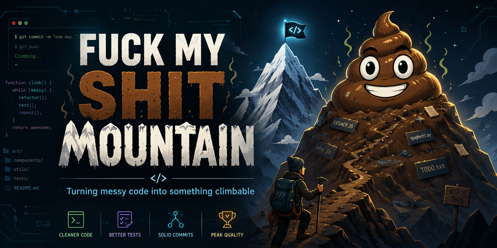

<p align="center">
  <a href="README.md">中文</a> · <strong>English</strong>
</p>

# Fuck My Shit Mountain

A codebase audit skill for AI coding agents such as Codex, Claude Code, Copilot, and Gemini.

Use it when the project runs, but you can feel the mountain shifting under your feet. The skill asks the agent to map the repository first, then produce an evidence-backed audit report for the areas you care about: risks, impact, priority, fixes, and tests. The name is a joke. The report tries hard not to be.

AI review is still review assistance. Treat the output as a sharp first pass, then confirm important findings with humans, tests, and production signals.

## Lazy Install

Paste this repository link into your AI IDE and ask it to install the `fuck-my-shit-mountain/` skill for Codex:

[https://github.com/XiNian-dada/Fuck_My_Shit_Mountain](https://github.com/XiNian-dada/Fuck_My_Shit_Mountain)

If it asks how, tell it to clone this repository and copy the `fuck-my-shit-mountain/` folder into your skills directory. Beautifully unglamorous.

## What It Does

- Builds a quick project profile: language, framework, entry points, tests, dependencies, CI, config, and release files.
- If you do not choose a mode, lists the supported modes first and recommends options in your current language.
- Reports findings with severity, confidence, evidence, impact, fix guidance, and regression test ideas.
- Adds coverage confidence for each dimension: `High` / `Medium` / `Low` / `Not assessed`, with inspected evidence.
- Separates confirmed issues from risks that need verification.
- Can output Markdown or HTML. The HTML report includes navigation, score bars, finding tables, a coverage matrix, and a remediation plan.

## Which Mode Should I Pick?

You can describe what you want in plain language. You do not have to memorize internal mode names.

| Goal | Say something like | Likely modes |
|------|--------------------|--------------|
| Get the whole picture | Full audit | `full` |
| Check before shipping | Release and operations | `release`, `stability`, `observability`, `configuration` |
| Worry about auth, secrets, or dependencies | Security and privacy | `security`, `privacy`, `supply-chain` |
| Audit a frontend | Frontend UX | `accessibility`, `frontend-state`, `performance` |
| Audit API and data flows | Backend API and data | `backend-api`, `data-integrity`, `stability` |
| Review an AI / LLM app | AI safety and cost | `ai-safety`, `privacy`, `cost`, `observability` |
| Tests look suspiciously green | Testing confidence | `testing`, `testing-authenticity` |
| The code is getting hard to change | Maintainability and docs | `maintainability`, `documentation`, `comment-coverage`, `code-consistency` |

Example prompt:

```text
Use the fuck-my-shit-mountain skill to audit this project.
I want a full audit.
Report language: English
Output format: html
```

## All Modes

`full` covers 25 audit dimensions. Advanced users can pass several mode names directly, such as `security, stability, type-safety`.

| Mode | Focus |
|------|-------|
| `full` | All 25 dimensions |
| `architecture` | Boundaries, dependency direction, module ownership, state ownership |
| `security` | Auth, injection, secrets, sensitive operations, security regressions |
| `stability` | Error handling, concurrency, lifecycle, retry behavior, crash paths |
| `performance` | Hot paths, memory, I/O, caching, startup and build cost |
| `testing` | Coverage gaps, test layers, edge cases, brittle tests |
| `maintainability` | Complexity, coupling, duplication, naming, readability |
| `design` | Engineering principles, abstraction boundaries, extensibility risks |
| `release` | CI/CD, versioning, migrations, rollback, pre-release checks |
| `documentation` | README, setup docs, API docs, operation and contributor guides |
| `observability` | Logs, metrics, tracing, health checks, alerts, runbooks |
| `configuration` | Config schema, defaults, environment separation, feature flag cleanup |
| `data-integrity` | Transactions, idempotency, migrations, backup/restore, partial writes |
| `privacy` | PII, log leakage, minimization, retention, deletion, export |
| `accessibility` | Keyboard flow, focus, semantic labels, loading/empty/error states, responsive layout |
| `supply-chain` | Lockfiles, dependency sources, CI pinning, SBOM, release signing |
| `cost` | Cloud resources, queues, caches, background jobs, external API / LLM bills |
| `ai-safety` | Prompt injection, tool authorization, RAG leakage, fallback, evals, rate limits |
| `fallback` | Silent degradation, empty catches, defensive guessing, swallowed errors |
| `testing-authenticity` | Over-mocking, implementation-detail tests, fake confidence, missing real paths |
| `type-safety` | Unsafe code, type assertions, boundary types, nullability, dynamic input |
| `frontend-state` | Component state, side effects, duplicated state, data flow, rendering boundaries |
| `backend-api` | API consistency, validation, pagination, N+1, authorization and data access |
| `dependency-weight` | Heavy dependencies, duplicate libraries, build-tool bloat, standard alternatives |
| `code-consistency` | Naming, imports, directory patterns, style consistency |
| `comment-coverage` | Comment coverage, public API docs, stale comments, misleading comments |

## Report Shape

The most useful sections are:

- Score panel: seven core dimensions, from 0.0 to 10.0. Higher is cleaner.
- Coverage matrix: what was inspected, what was skipped, and how confident the audit is.
- Top risks: the issues most likely to hurt you first.
- Detailed findings: evidence, impact, fix guidance, test guidance, and effort estimate.
- Remediation order: fix now, fix before release, schedule, or keep watching.

```text
Security        ████████░░  8.0  A
Stability       ██████░░░░  6.0  B
Performance     ██████████  10.0 S
Testing         ████░░░░░░  4.0  C
Maintainability ███████░░░  7.0  A
Design          █████░░░░░  5.0  B
Release         ██████░░░░  6.0  B
─────────────────────────────────────
Overall         ██████░░░░  6.6  B
```

## Demo

Open the static demo to see the HTML report layout:

[https://xinian-dada.github.io/Fuck_My_Shit_Mountain/](https://xinian-dada.github.io/Fuck_My_Shit_Mountain/)

The demo audit data is fictional and marked as such on the page.

## Manual Install

For Codex, clone the repository and copy the skill folder:

```bash
git clone https://github.com/XiNian-dada/Fuck_My_Shit_Mountain.git
mkdir -p ~/.codex/skills
rm -rf ~/.codex/skills/fuck-my-shit-mountain
cp -R Fuck_My_Shit_Mountain/fuck-my-shit-mountain ~/.codex/skills/
```

Restart Codex, or open a new conversation.

For other agents, copy `fuck-my-shit-mountain/` into the matching directory:

This repository ships a standard `SKILL.md + prompts + rubrics + templates` directory. Codex is the main target, but the skill can also be placed in other agent instruction directories.

| Tool | Common install path |
|------|---------------------|
| Codex | `~/.codex/skills/fuck-my-shit-mountain/` |
| Claude Code | `~/.claude/skills/fuck-my-shit-mountain/` or `.claude/skills/fuck-my-shit-mountain/` |
| GitHub Copilot | `~/.copilot/skills/fuck-my-shit-mountain/`, `~/.agents/skills/fuck-my-shit-mountain/`, or `.github/skills/fuck-my-shit-mountain/` |
| Gemini CLI | `~/.gemini/skills/fuck-my-shit-mountain/`, `~/.agents/skills/fuck-my-shit-mountain/`, or `.gemini/skills/fuck-my-shit-mountain/` |

## Star History

<a href="https://www.star-history.com/#XiNian-dada/Fuck_My_Shit_Mountain&Date">
  <picture>
    <source media="(prefers-color-scheme: dark)" srcset="https://api.star-history.com/svg?repos=XiNian-dada/Fuck_My_Shit_Mountain&type=Date&theme=dark" />
    <source media="(prefers-color-scheme: light)" srcset="https://api.star-history.com/svg?repos=XiNian-dada/Fuck_My_Shit_Mountain&type=Date" />
    
  </picture>
</a>

## License

MIT

---

Learn AI on [LinuxDo](https://linux.do/)
