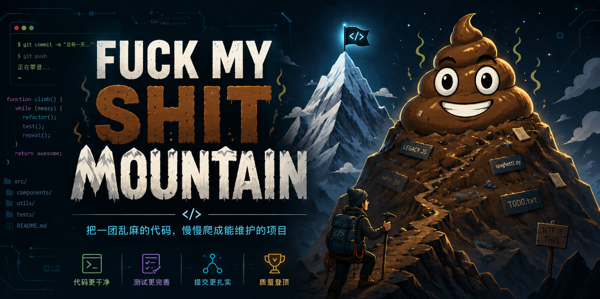

<p align="center">
  <strong>中文</strong> · <a href="README.en.md">English</a>
</p>

# Fuck My Shit Mountain

给 Codex、Claude Code、Copilot、Gemini 这类 AI coding agent 用的代码库审计 skill。

它适合那种“项目能跑，但我总觉得山里埋了东西”的时刻：让 AI 先摸清代码库，再按你关心的方向给一份带证据、带优先级、带修复建议的审计报告。名字很不严肃，报告会尽量严肃。

AI 审计不能替代人工 review、测试和真实运行数据。它更像一个不怕翻垃圾堆的同行，帮你把风险先挖出来、排好队。

## 懒人入口

把这个仓库链接丢给你的 AI IDE，让它把 `fuck-my-shit-mountain/` 这个 skill 装到 Codex 里：

[https://github.com/XiNian-dada/Fuck_My_Shit_Mountain](https://github.com/XiNian-dada/Fuck_My_Shit_Mountain)

它如果问“怎么装”，告诉它：clone 这个仓库，然后把里面的 `fuck-my-shit-mountain/` 目录复制到你的 skills 目录。没错，就这么朴素。

## 它会做什么

- 先做项目画像：语言、框架、入口、测试、依赖、CI、配置、发布文件。
- 在用户没说清模式时，先列出可选模式，再用用户当前语言推荐方向。
- 按所选维度输出发现项：严重程度、置信度、证据、影响、修复建议、回归测试。
- 为每个维度标注覆盖置信度：`High` / `Medium` / `Low` / `Not assessed`，并写清楚看过哪些证据。
- 区分已确认问题和待确认风险，避免把“没发现”直接吹成满分。
- 可输出 Markdown 或 HTML 报告；HTML 版带侧边栏、评分条、发现表、覆盖矩阵和修复计划。

## 该选哪个模式

你可以直接用自然语言说目标，不需要背内部 mode 名。比如：

| 你想要 | 可以这样说 | 内部会偏向 |
|--------|------------|------------|
| 先看全貌 | 全量审计 | `full` |
| 上线前扫一遍 | 偏发布与运维 | `release`, `stability`, `observability`, `configuration` |
| 怕权限、密钥、依赖出事 | 偏安全与隐私 | `security`, `privacy`, `supply-chain` |
| 前端体验不放心 | 偏前端体验 | `accessibility`, `frontend-state`, `performance` |
| 后端接口和数据链路比较重 | 偏后端接口与数据 | `backend-api`, `data-integrity`, `stability` |
| AI / LLM 应用 | 偏 AI 安全与成本 | `ai-safety`, `privacy`, `cost`, `observability` |
| 测试绿得有点可疑 | 偏测试补强 | `testing`, `testing-authenticity` |
| 代码越来越难改 | 偏可维护性与文档 | `maintainability`, `documentation`, `comment-coverage`, `code-consistency` |

示例提示词：

```text
请使用 fuck-my-shit-mountain skill 审计当前项目
我想先做全量审计
报告语言：中文
输出格式：html
```

## 全部模式

`full` 会覆盖 25 个审计维度。熟悉以后，也可以直接写多个 mode 名，比如 `security, stability, type-safety`。

| 模式 | 看什么 |
|------|--------|
| `full` | 全部 25 个维度 |
| `architecture` | 架构边界、依赖方向、模块职责、状态所有权 |
| `security` | 认证授权、注入、密钥、敏感操作、常见安全回归 |
| `stability` | 错误处理、并发、生命周期、重试、崩溃路径 |
| `performance` | 热点路径、内存、I/O、缓存、启动和构建开销 |
| `testing` | 覆盖缺口、测试层级、边界用例、脆弱测试 |
| `maintainability` | 复杂度、耦合、重复、命名、可读性 |
| `design` | 工程原则、抽象边界、扩展方式、设计风险 |
| `release` | CI/CD、版本、迁移、回滚、发布前检查 |
| `documentation` | README、设置说明、API 文档、运维/开发指南 |
| `observability` | 日志、指标、追踪、健康检查、告警、runbook |
| `configuration` | 配置 schema、默认值、环境隔离、feature flag 清理 |
| `data-integrity` | 事务、幂等、迁移、备份恢复、部分写入 |
| `privacy` | PII、日志泄露、数据最小化、保留/删除/导出 |
| `accessibility` | 键盘、焦点、语义标签、错误/空/加载状态、响应式 |
| `supply-chain` | 锁文件、依赖来源、CI pinning、SBOM、发布签名 |
| `cost` | 云资源、队列、缓存、后台任务、外部 API / LLM 账单 |
| `ai-safety` | Prompt injection、工具授权、RAG 泄露、fallback、eval、限流 |
| `fallback` | 静默降级、空 catch、防御性猜测、吞错 |
| `testing-authenticity` | 过度 mock、只测实现细节、假绿色、缺少真实路径 |
| `type-safety` | unsafe、类型断言、边界类型、空值和动态输入 |
| `frontend-state` | 组件状态、副作用、状态重复、数据流和渲染边界 |
| `backend-api` | API 一致性、校验、分页、N+1、权限和数据访问模式 |
| `dependency-weight` | 过重依赖、重复库、构建工具链、可替代标准能力 |
| `code-consistency` | 命名、导入、目录模式、风格统一性 |
| `comment-coverage` | 注释覆盖率、公共 API 文档、过期注释、误导性注释 |

## 报告长什么样

报告里最常看的几块：

- 评分面板：7 个核心维度，0.0-10.0 分，越高越干净。
- 覆盖矩阵：每个维度查了什么、没查什么、覆盖置信度如何。
- 最高风险：按严重程度和影响排序，不让小毛刺淹没真问题。
- 详细发现：证据、影响、修复建议、测试建议、工作量估计。
- 修复顺序：立即处理、发布前处理、排期处理、后续观察。

```text
Security        ████████░░  8.0  A
Stability       ██████░░░░  6.0  B
Performance     ██████████  10.0 S
Testing         ████░░░░░░  4.0  C
Maintainability ███████░░░  7.0  A
Design          █████░░░░░  5.0  B
Release         ██████░░░░  6.0  B
─────────────────────────────────────
Overall         ██████░░░░  6.6  B
```

## Demo

想先看页面效果，可以打开这份静态演示：

[https://xinian-dada.github.io/Fuck_My_Shit_Mountain/](https://xinian-dada.github.io/Fuck_My_Shit_Mountain/)

演示内容是虚构审计，页面顶部也有标注。

## 手动安装

如果你想自己装，流程也很短：

```bash
git clone https://github.com/XiNian-dada/Fuck_My_Shit_Mountain.git
mkdir -p ~/.codex/skills
rm -rf ~/.codex/skills/fuck-my-shit-mountain
cp -R Fuck_My_Shit_Mountain/fuck-my-shit-mountain ~/.codex/skills/
```

然后重启 Codex，或者新开一个对话。

要装到别的 agent，就把 `fuck-my-shit-mountain/` 复制到对应位置：

这个仓库提供标准 `SKILL.md + prompts + rubrics + templates` 目录。除了 Codex，也可以放到其他支持 skill / agent instructions 的工具里使用。

| 工具 | 常见安装位置 |
|------|--------------|
| Codex | `~/.codex/skills/fuck-my-shit-mountain/` |
| Claude Code | `~/.claude/skills/fuck-my-shit-mountain/` 或 `.claude/skills/fuck-my-shit-mountain/` |
| GitHub Copilot | `~/.copilot/skills/fuck-my-shit-mountain/`、`~/.agents/skills/fuck-my-shit-mountain/` 或 `.github/skills/fuck-my-shit-mountain/` |
| Gemini CLI | `~/.gemini/skills/fuck-my-shit-mountain/`、`~/.agents/skills/fuck-my-shit-mountain/` 或 `.gemini/skills/fuck-my-shit-mountain/` |

## Star History

<a href="https://www.star-history.com/#XiNian-dada/Fuck_My_Shit_Mountain&Date">
  <picture>
    <source media="(prefers-color-scheme: dark)" srcset="https://api.star-history.com/svg?repos=XiNian-dada/Fuck_My_Shit_Mountain&type=Date&theme=dark" />
    <source media="(prefers-color-scheme: light)" srcset="https://api.star-history.com/svg?repos=XiNian-dada/Fuck_My_Shit_Mountain&type=Date" />
    
  </picture>
</a>

## License

MIT

---

学 AI 上 [LinuxDo](https://linux.do/)
